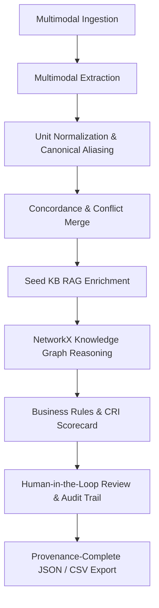

# SpectraAI 🔬✨

> **Multimodal Product Intelligence — From Messy Datasheets & Photos to Validated, Source-Cited Catalog Records**

[](LICENSE)
[](.python-version)
[](.nvmrc)
[-brightgreen.svg)](tests/)
[-brightgreen.svg)](test_e2e.py)
[-brightgreen.svg)](frontend/test_smoke.js)
[](https://fastapi.tiangolo.com)
[](https://react.dev)

---

## 📌 Problem Statement

Industrial e-commerce and catalog operations face a severe data ingestion bottleneck:

1. **Unstructured & Heterogeneous Sources:** Product data is trapped in dense 40-page PDF datasheets, blurry nameplate inspection photos, and sparse ERP CSV exports.
2. **Conflicting Specifications:** Different sources frequently disagree on critical electrical and mechanical attributes (e.g., nameplate specifies `460V` while the engineering datasheet lists `480V`).
3. **Unit Inconsistencies & Ambiguities:** Power, voltage, weight, and dimensions are published in mixed units (`kW` vs `HP`, `lbs` vs `kg`, `kV` vs `V`) that break search filters and parametric comparisons.
4. **Missing Industrial Taxonomy:** Raw vendor catalogs lack standard classification codes (UNSPSC, ETIM), search-optimized commercial titles, and verified cross-reference part matches.
5. **Hallucination & Black-Box Risk:** Standard LLMs frequently hallucinate plausible-looking specs without citations, erasing source traceability required by engineering review teams.

---

## 💡 Value Proposition: How SpectraAI Solves This

SpectraAI is an end-to-end multimodal intelligence engine designed for industrial catalog managers, distributors, and e-commerce engineers:

- **Source-Cited Multimodal Extraction:** Extracts structured attributes from PDFs, images, and tabular CSVs with exact page, table, and bounding citations.
- **Transparent Unit Normalization:** Standardizes power, voltage, weight, temperature, and dimensions while preserving original raw values, raw units, and transformation rules in immutable provenance receipts.
- **Multi-Source Concordance & Conflict Scoring:** Boosts confidence when independent sources agree, and surfaces explicit conflict candidates with a `0.7x` confidence penalty when they disagree.
- **Industrial Taxonomy Enrichment:** Classifies products into UNSPSC commodity codes and ETIM technical classes using grounded RAG retrieval over seed knowledge bases.
- **NetworkX Knowledge Graph Reasoning:** Models cross-catalog relationships, detects statistical specification outliers across category siblings, and matches interchangeable parts with engineering safety disclaimers.
- **5-Dimension Commerce Readiness Index (CRI):** Evaluates catalog readiness (0-100%) across Identity, Specifications Depth, Taxonomy Compliance, Commercial Content, and Quality.
- **Human-in-the-Loop Auditability:** Enables reviewers to override fields with documented reasons and reviewer identities, appending immutable change receipts without erasing source evidence.
- **Local, Offline & Privacy-Safe by Default:** Operates 100% locally with zero required external API keys or cloud dependencies for baseline execution.

---

## ⚡ 5-Minute Developer Quickstart (Clean Checkout)

SpectraAI uses native tooling with zero container requirements, supporting **Windows, macOS, and Linux**.

### Prerequisites
- **Python:** `3.12` or `3.13` ([python.org](https://www.python.org/downloads/))
- **Node.js:** `18+`, `20+`, or `24+` with Corepack / npm ([nodejs.org](https://nodejs.org/))
- **Package Manager:** Python `uv` (recommended) or `pip`/`venv`

---

### Option A: Cross-Platform Task Runner (`task.py` / `Makefile`)

```bash
# 1. Setup both backend and frontend dependencies:
python task.py setup        # (or: make setup)

# 2. Start Backend in Terminal 1 (FastAPI on Port 8000):
python task.py run-backend  # (or: make run-backend)

# 3. Start Frontend in Terminal 2 (Vite on Port 5173):
python task.py run-frontend # (or: make run-frontend)
```

---

### Option B: Fast Setup with `uv` (Manual)

```bash
# Backend (Terminal 1):
uv venv .venv
uv pip install -r backend/requirements.txt
cd backend && python main.py

# Frontend (Terminal 2):
corepack enable
npm --prefix frontend install
npm --prefix frontend run dev
```

---

### Option C: One-Click Convenience Launchers

- **Windows:** Double-click [`run_backend.bat`](file:///c:/Users/viswa/Desktop/SpectraAI/run_backend.bat) and [`run_frontend.bat`](file:///c:/Users/viswa/Desktop/SpectraAI/run_frontend.bat)
- **macOS / Linux:** Run `./run_backend.sh` and `./run_frontend.sh`

---

→ **Interactive Dashboard:** [`http://localhost:5173`](http://localhost:5173)  
→ **Backend API:** [`http://localhost:8000`](http://localhost:8000)  
→ **Interactive OpenAPI Docs:** [`http://localhost:8000/docs`](http://localhost:8000/docs)  
→ **Live System Diagnostics:** [`http://localhost:8000/api/diagnostics`](http://localhost:8000/api/diagnostics)

---

## 🎯 Dual Execution Modes: Fallback Demo vs. Live Claude

| Capability | Smart Fallback / Demo Mode (Default) | Live Claude Vision Mode (Optional) |
|---|---|---|
| **API Key Requirement** | **Zero (No API Key Required)** | Requires `ANTHROPIC_API_KEY` in `.env` |
| **Network Access** | **100% Offline & Deterministic** | Requires external API connection to Anthropic |
| **PDF Extraction** | Real offline text parsing via `pypdf` | Zero-shot visual OCR & table parsing via Claude 3.5 Sonnet |
| **Image Extraction** | Deterministic synthetic nameplate fixture | Zero-shot visual OCR via Claude 3.5 Sonnet |
| **Conflict Simulation** | Engineered `460V` vs `480V` conflict | Real multi-source conflict detection on live uploads |
| **Suitability** | CI/CD pipelines, offline reviews, demos, unit tests | Production deployments & arbitrary document parsing |

To enable Live Claude mode, copy `.env.example` to `.env` and configure `ANTHROPIC_API_KEY=your_key_here`.

---

## 📊 Feature Matrix: Verified Today vs. Planned Next



### ✅ Verified Today (v1.0.0 Release)

| Feature Area | Implementation Details | Verification Evidence |
|---|---|---|
| **Multimodal Extraction** | Offline `pypdf` datasheet parsing, CSV table parsing, fallback synthetic demo data, and Claude Vision adapter. | [`tests/test_extract.py`](file:///c:/Users/viswa/Desktop/SpectraAI/tests/test_extract.py) |
| **Unit Normalization** | Canonical aliasing & non-destructive conversions for Power (`kW`/`HP` → `W`), Voltage (`kV`/`mV`/`VAC` → `V`), Weight (`lbs`/`g` → `kg`), Temp (`°F` → `°C`), and Dimensions (`in` → `mm`). | [`tests/test_normalize.py`](file:///c:/Users/viswa/Desktop/SpectraAI/tests/test_normalize.py) |
| **Conflict Surfacing** | Multi-source disagreement detection with `0.7x` confidence penalty and explicit candidate list (`460V` vs `480V`). | [`tests/test_merge.py`](file:///c:/Users/viswa/Desktop/SpectraAI/tests/test_merge.py) |
| **Taxonomy Mapping** | UNSPSC (`26101100 - Electric Motors`) and ETIM (`EC001851`) enrichment via grounded seed KB. | [`tests/test_enrich.py`](file:///c:/Users/viswa/Desktop/SpectraAI/tests/test_enrich.py) |
| **Knowledge Graph** | NetworkX category clustering, statistical outlier warnings (>2.5x variance), interchangeable part matching. | [`tests/test_knowledge_graph.py`](file:///c:/Users/viswa/Desktop/SpectraAI/tests/test_knowledge_graph.py) |
| **CRI Scorecard** | 5-dimension scorecard (Identity, Specs, Taxonomy, Content, Quality) with uncertainty disclaimers. | [`tests/test_validate.py`](file:///c:/Users/viswa/Desktop/SpectraAI/tests/test_validate.py) |
| **Human Review** | Reviewer selection, reason presets, immutable audit log appending with observation type `human_verified`. | [`tests/test_pipeline_e2e.py`](file:///c:/Users/viswa/Desktop/SpectraAI/tests/test_pipeline_e2e.py) |
| **Observability** | Correlation ID middleware (`X-Correlation-ID`, `X-Response-Time-Ms`), local [`GET /api/diagnostics`](file:///c:/Users/viswa/Desktop/SpectraAI/docs/api-contract.md). | [`tests/test_telemetry.py`](file:///c:/Users/viswa/Desktop/SpectraAI/tests/test_telemetry.py) |

### 🔮 Planned Next (Milestones 2–4)
- **Batch Catalog Processing:** Zip/folder ingestion with parallel asynchronous worker queues (Milestone 2).
- **Catalog-Wide Conflict Dashboard:** Cross-product priority sorting by conflict severity (Milestone 2).
- **Cross-Category Reasoning:** Connecting motors to compatible variable frequency drives and gearboxes (Milestone 3).
- **Multi-Model Benchmark Suite:** Curated evaluation comparing Claude 3.5, GPT-4o, Gemini 1.5, and local open-weight VLMs (Milestone 4).

---

## 🎬 Sample Walkthrough: The UltraDrive X500 Demo

1. **Load Sample Batch:** In the frontend dashboard ([`http://localhost:5173`](http://localhost:5173)), click **"Load Sample Batch"**.
2. **Watch Live SSE Stages:** Observe the 6-stage async pipeline execute:
   `Ingestion (Hashes) → Extraction → Merge & Conflict → Enrichment → Knowledge Graph → Validation`.
3. **Inspect the Multi-Source Conflict:**
   - The top banner flags an engineered conflict on `voltage`:
     - **Datasheet (PDF):** `480V` (confidence `0.90`)
     - **Nameplate (Image):** `460V` (confidence `0.92`)
   - The field status drops to `conflicted` with confidence penalized to `0.64`.
4. **Inspect Normalization Receipts:** Click on `power_watts` to view the non-destructive normalization receipt: `15 kW → 15000 W (Converted 15.0 kW to Watts (* 1000))`.
5. **Apply Human-in-the-Loop Override:**
   - In the bottom review bar, select target field `voltage`, set value to `480V`, select reason *"Confirmed correct spec from physical nameplate photo"*, and click **"Append Correction Receipt"**.
   - Voltage status updates to `human_verified` (confidence `1.0`), and the immutable change is logged to SQLite.
6. **Approve & Export:** Click **"Approve Record"** and export the final intelligence report via **"Export CSV"** or **"Export JSON"**.

---

## 🩺 Health-Check & Verification Commands

```bash
# 1. Backend Health Check (SQLite, Knowledge Graph, Seed KB, VLM Mode)
curl -s http://localhost:8000/api/health

# 2. Live Diagnostics & Latency Metrics
curl -s http://localhost:8000/api/diagnostics

# 3. Modular Pytest Suite (Unit, Integration, API, E2E)
pytest -v

# 4. Compatibility E2E Runner (131 Tests)
python test_e2e.py

# 5. Frontend Smoke Verification & Production Build
npm --prefix frontend test
npm --prefix frontend run build

# 6. Zero Deprecation Warnings Verification
python -W error::DeprecationWarning -c "import backend.models, backend.main, backend.pipeline; print('Clean!')"
```

---

## ⏱️ Performance Benchmarks (Reproducible)

SpectraAI includes a built-in deterministic benchmarking tool [`benchmark_pipeline.py`](file:///c:/Users/viswa/Desktop/SpectraAI/benchmark_pipeline.py):

```bash
python benchmark_pipeline.py --iterations 5
```

### Measured Execution Profile (Offline Mode)

| Pipeline Stage | Mean Latency | Min Latency | Max Latency | Subsystem Profile |
|---|---|---|---|---|
| **1. Ingestion** | `4.63 ms` | `3.69 ms` | `5.18 ms` | Source hashing & SQLite retrieval |
| **2. Extraction** | `1.37 ms` | `0.72 ms` | `3.70 ms` | Offline parsing & synthetic dispatch |
| **3. Merging** | `0.16 ms` | `0.14 ms` | `0.21 ms` | Aliasing & unit normalization |
| **4. Enrichment** | `0.14 ms` | `0.12 ms` | `0.20 ms` | In-memory RAG keyword search |
| **5. Knowledge Graph** | `0.10 ms` | `0.08 ms` | `0.12 ms` | NetworkX graph add & outlier check |
| **6. Validation & CRI** | `0.16 ms` | `0.07 ms` | `0.49 ms` | Sanity checks & 5-dimension scoring |
| **Total End-to-End** | **`13.26 ms`** | **`10.70 ms`** | **`18.14 ms`** | **Throughput: ~74 records/sec** |

*Peak memory overhead during benchmark: `0.154 MB`. For full profiling methodology, see [`docs/performance-benchmark.md`](file:///c:/Users/viswa/Desktop/SpectraAI/docs/performance-benchmark.md).*

---

## 🔄 Resetting Local SQLite State

To reset local state to an initial pristine condition:

```bash
python task.py reset-demo
# Or using make: make reset-demo
```

Or manually:
- **Windows (PowerShell):** `Remove-Item -Force backend\product_intelligence.db; Remove-Item -Force backend\uploads\* -Exclude .gitkeep`
- **macOS / Linux:** `rm -f backend/product_intelligence.db && find backend/uploads -mindepth 1 ! -name '.gitkeep' -delete`

*When `backend/main.py` is started, it will detect an empty database and automatically seed the baseline `PROD-DEMO-X500` demo product.*

---

## 📡 REST API Contract

Complete OpenAPI specification is documented at [`docs/api-contract.md`](file:///c:/Users/viswa/Desktop/SpectraAI/docs/api-contract.md) and interactively at `http://localhost:8000/docs`.

| Method | Path | Summary | Response Model |
|---|---|---|---|
| `GET` | `/` | Root service metadata & health | `RootResponse` |
| `GET` | `/api/health` | Subsystem readiness probe | `HealthCheckResponse` |
| `GET` | `/api/diagnostics` | Live performance latencies & metrics | `DiagnosticsResponse` |
| `POST` | `/api/upload` | Upload PDF/Image/CSV sources | `UploadResponse` |
| `POST` | `/api/demo/load-sample` | Trigger demo pipeline asynchronously | `DemoLoadResponse` |
| `GET` | `/api/pipeline/status/{job_id}` | Live SSE progress stream | Server-Sent Events |
| `POST` | `/api/pipeline/run` | Trigger pipeline for specific sources | `PipelineRunResponse` |
| `GET` | `/api/products` | List all processed products | `ProductListResponse` |
| `GET` | `/api/products/{id}` | Get product record & outlier warnings | `ProductDetailResponse` |
| `PUT` | `/api/products/{id}/fields/{field}` | Human field override with audit log | `ProductEditResponse` |
| `POST` | `/api/products/{id}/approve` | Approve record for catalog publishing | `ProductApproveResponse` |
| `GET` | `/api/products/{id}/history` | Get immutable edit audit history | `EditHistoryResponse` |
| `GET` | `/api/graph` | Export knowledge graph for D3 force layout | `KnowledgeGraphResponse` |

---

## ⚠️ Limitations & Boundaries

1. **Synthetic Demo Fixtures:** Non-credentialed fallback mode runs against synthetic industrial motor fixtures designed to demonstrate conflict resolution and unit conversion. Live custom document parsing requires `ANTHROPIC_API_KEY`.
2. **AI-Generated Content Disclaimers:** Synthesized SEO titles carry an explicit `[AI Generated / Draft]` tag and require human sign-off before publishing.
3. **Engineering Disclaimers:** Interchangeable parts matched by specification are cross-reference suggestions; physical mounting tolerances must be verified before engineering substitution.
4. **CRI Interpretation:** The Commerce Readiness Index measures schema completeness and rule conformance; it is not an engineering warranty.

---

## 💡 Suggested Repository Metadata (For Maintainers)

Maintainers may configure the following GitHub repository settings:

- **Repository Description:** `Multimodal Product Intelligence Engine: Extract, normalize, cross-validate, and enrich industrial product records with source-cited provenance and human-in-the-loop review.`
- **Suggested Topics:** `product-intelligence`, `fastapi`, `react`, `multimodal-ai`, `knowledge-graph`, `rag`, `provenance`, `datasheet-extraction`, `industrial-ecommerce`
- **Release / Tag Strategy:** `v1.0.0` tagged from `main` following [`CHANGELOG.md`](file:///c:/Users/viswa/Desktop/SpectraAI/CHANGELOG.md) and [`docs/release-checklist.md`](file:///c:/Users/viswa/Desktop/SpectraAI/docs/release-checklist.md).

---

## 👥 Authors, Attribution & Governance

- **Original Creator & Maintainer:** [@dheeraj0677](https://github.com/dheeraj0677) (GOPI SETTY LAKSHMI DHEERAJ)
- **License:** [MIT License](LICENSE) — Copyright (c) 2026 SpectraAI Contributors & dheeraj0677
- **Third-Party Attributions:** See [`ATTRIBUTION.md`](file:///c:/Users/viswa/Desktop/SpectraAI/ATTRIBUTION.md) for dependencies and open standards citations.
- **Contributing:** See [`CONTRIBUTING.md`](file:///c:/Users/viswa/Desktop/SpectraAI/CONTRIBUTING.md) for branch strategy, Conventional Commits, and test checklists.
- **Security:** See [`SECURITY.md`](file:///c:/Users/viswa/Desktop/SpectraAI/SECURITY.md) for private vulnerability reporting.
- **Code of Conduct:** See [`CODE_OF_CONDUCT.md`](file:///c:/Users/viswa/Desktop/SpectraAI/CODE_OF_CONDUCT.md).
- **Roadmap:** See [`docs/roadmap.md`](file:///c:/Users/viswa/Desktop/SpectraAI/docs/roadmap.md).
