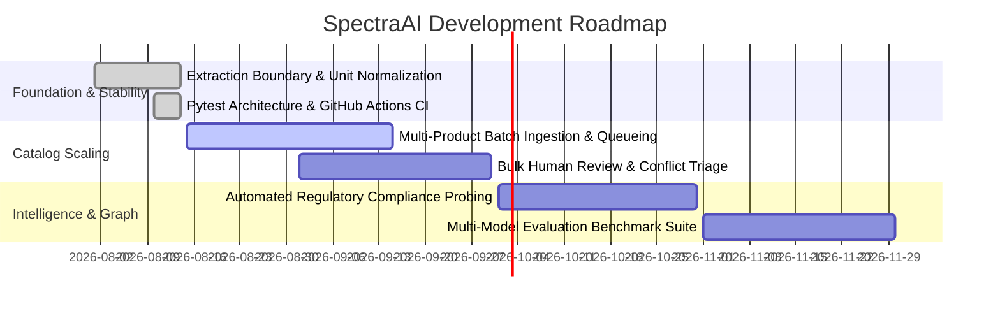

# SpectraAI Project Roadmap

This document outlines the development milestones, planned capabilities, and community contribution opportunities for SpectraAI.

---

## 🎯 Release Milestones

---

## 📍 Milestone 1: Stability, Testing & Provenance (Completed ✅)
- [x] **Zero-Secret CI Workflow:** GitHub Actions running Pytest and Vite builds with zero external API key requirements.
- [x] **Unit Normalization Engine:** Transparent, reversible normalization for Power, Voltage, Weight, Temperature, Dimensions.
- [x] **Immutable Provenance Trail:** Source citation retention across multi-source merge and human review edits.
- [x] **FastAPI Hardening:** Typed response models, structured error codes, and strict upload payload sanitization.
- [x] **CRI Scorecard Breakdown:** 5-dimension Commerce Readiness Index with visual progress indicators and uncertainty disclaimers.

---

## 📍 Milestone 2: Multi-Product Batch Operations (Next Up 🚀)
- [ ] **Batch Zip / Folder Ingestion:** Upload multiple datasheets simultaneously with parallel async extraction worker pools.
- [ ] **Catalog-Wide Conflict Triage:** Dedicated table view prioritizing products by conflict severity and CRI score.
- [ ] **Custom Field Schema Configurator:** UI panel allowing catalog managers to define custom required specifications per category.
- [ ] **Enhanced Export Formats:** Direct export to Shopify CSV, Akeneo PIM, and syndication formats.

---

## 📍 Milestone 3: Advanced Knowledge Graph & Ontology (Planned 🔮)
- [ ] **Cross-Category Compatibility Matching:** Graph-based reasoning connecting motors to compatible variable frequency drives (VFDs) and gearboxes.
- [ ] **Regulatory Compliance Verifier:** Automatic cross-checking of UL, CE, RoHS, and NEMA certifications against published regulatory registries.
- [ ] **Persistent Graph Store Option:** Pluggable backend adapter for Neo4j / Memgraph for enterprise catalog deployments (>100k nodes).

---

## 📍 Milestone 4: Multi-Model Evaluation Benchmark (Planned 📊)
- [ ] **Curated Multimodal Benchmark Dataset:** Non-sensitive ground truth dataset spanning 50+ messy datasheets and nameplates.
- [ ] **Model Comparison Matrix:** Automated benchmarking comparing extraction accuracy and latency across Claude 3.5 Sonnet, GPT-4o, Gemini 1.5 Pro, and local open-weight vision models (e.g. Qwen2-VL).

---

## 🤝 How to Propose a Roadmap Item
To suggest a new feature or research direction:
1. Open a **[Feature Request](https://github.com/dheeraj0677/SpectraAI/issues/new?template=feature_request.yml)** or **[Research Proposal](https://github.com/dheeraj0677/SpectraAI/issues/new?template=research_benchmark.yml)**.
2. Join the discussion in **[GitHub Discussions](https://github.com/dheeraj0677/SpectraAI/discussions)** to align on technical design.
